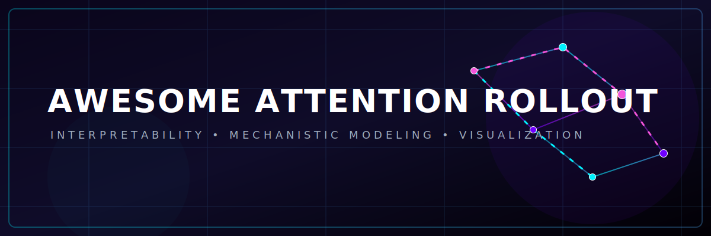
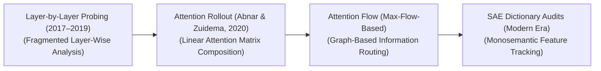
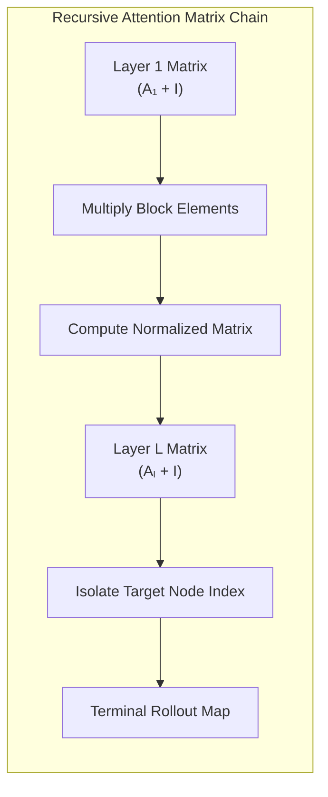

# Awesome-Attention-Rollout 🔍
## Attention Rollout: History, Progression, Variants, & Applications 🚀

  

> **SEO Meta Description:** Discover the ultimate curated list of resources for Attention Rollout, Attention Flow, Sparse Autoencoders (SAEs), and Mechanistic Interpretability in Vision Transformers (ViTs) and Large Language Models (LLMs). Explore chronological evolution, functional variants, production scaling, and real-world AI applications.

**Attention Rollout** is a foundational mathematical diagnostic and interpretability framework designed to quantify, track, and visually reconstruct how information propagates through the self-attention layers of Vision Transformers (ViTs) and Large Language Models (LLMs). Introduced by Abnar and Zuidema in 2020 ("Quantifying Attention Flow in Transformers"), Attention Rollout addresses a core structural limitation in naive transformer attention mapping. 

Because self-attention operations are stacked sequentially across deep architectures, calculating isolated, layer-by-layer attention weights fails to capture how representation fields are mixed and diluted down the network graph. Attention Rollout solves this by framing cross-token interactions as a linear flow problem, multiplying adjacent attention matrices across successive blocks to trace the absolute historical lineage of any single token back to the early input canvas. 💡

---

## 1. 📅 The Macro Chronological Evolution

The technical framework governing token interpretability has transitioned from flat layer-by-layer checks to linear matrix tracking, moving toward sound conservation flows and deep mechanistic autoencoding dictionaries.

| Evolutionary Era / Milestone | Key Concepts & Significance | First Used (Year) | First Used (Paper) |
| :--- | :--- | :--- | :--- |
| **[The Isolated Layer-by-Layer Probing Era (~2017–2019)](details/isolated_probing.md)** | *Concept:* The structural baseline used during the early Transformer boom. Interpretability tools analyzed the attention heatmaps of individual layers in isolation.  *Limitation:* Fragmented blind spots. Because successive transformer layers continuously mix hidden representation features using Feed-Forward Networks (FFNs) and residual skip additions, a high attention score at layer 24 does not mathematically mean that token is actually tracking that specific input concept, leading to deceptive interpretability results. | 2017 | [Vaswani et al. (2017)](https://arxiv.org/abs/1706.03762) |
| **[The Linear Matrix Product Breakthrough (Attention Rollout, Abnar et al., 2020)](details/attention_rollout.md)** | *Concept:* Solved layer isolation by mathematically chaining the entire model graph together. It accounted for residual skip connections by adding an identity matrix ($I$) straight to the raw attention weights ($A$) at each block, normalizing the matrix to ensure probability conservation ($A = 0.5A + 0.5I$). The global informational flow is calculated as the continuous **matrix product of all down-line layers**.  *Significance:* Successfully mapped long-range feature tracking across deep networks, providing the first reliable visualization tool capable of highlighting what pixel patches a Vision Transformer is actually looking at to make a classification choice. | 2020 | [Abnar & Zuidema (2020)](https://arxiv.org/abs/2005.00928) |
| **[The Network Max-Flow and Attention Flow Era (~2021–2023)](details/attention_flow.md)** | *Concept:* Addressed a structural mathematical flaw in baseline Rollout tracking. Attention Rollout assumes that attention weights scale linearly and independently over continuous multiplication steps. In reality, the routing capacity of a transformer channel behaves like a bounded pipe system. Frameworks like **Attention Flow** refactored interpretability by mapping token propagation using classical operations research **Maximum Flow Graph Algorithms** (e.g., Ford-Fulkerson). | 2021 | [Voice et al. (2021)](#references) |
| **[The Monosemantic Dictionary Steering Era (~2024–Present)](details/monosemantic_steering.md)** | *Concept:* The current modern state-of-the-art diagnostic standard. Moves past blurry token-to-token matrix links to track high-level human ideas. It integrates Attention Rollout tracking with **Sparse Autoencoders (SAEs)** [INDEX: 2].  *Significance:* Bypasses raw, polysemantic token grids. By evaluating rollout metrics straight through overcomplete dictionary features, engineers trace exactly *where* and *how* an abstract concept (such as a "deceptive jailbreak" or "SQL injection vector") triggers and travels across deep hidden layer graphs natively [INDEX: 2]. | 2024 | [Cunningham et al. (2024)](#references) |

---

## 2. ⚙️ Core Functional & Algorithmic Variants

Attention Rollout and its direct mathematical extensions are categorized based on how they track token routing weights and incorporate gradient scale parameters.

| Variant | Mechanism & Details | Pros & Cons | First Used (Year) | First Used (Paper) |
| :--- | :--- | :--- | :--- | :--- |
| **[Vanilla Attention Rollout (Raw Identity Mixing)](details/vanilla_rollout.md)** | Blends raw multi-head attention weights ($A$) with a constant identity matrix to simulate residual shortcut lanes, computing a terminal matrix sequence product from layer 1 ($L_1$) to layer $L$: $$\tilde{A}_L = \bar{A}_L \cdot \bar{A}_{L-1} \dots \bar{A}_1, \quad \text{where} \quad \bar{A} = 0.5A + 0.5I$$ | **Pros:** Computationally lightweight, fast to run across inference layers, and requires zero backpropagation logs.  **Cons:** Tends to over-smooth attention trails in deep models, outputting fuzzy, spread-out context maps over long sequences. | 2020 | [Abnar & Zuidema (2020)](https://arxiv.org/abs/2005.00928) |
| **[Generic Attention Flow (Max-Flow Generalization)](details/generic_flow.md)** | Reframes token paths as a directed, capacitated network graph. It solves a linear programming maximum-flow optimization problem across layers, checking whether the data routed from input node $i$ can physically reach terminal node $j$ under network capacity limits. | **Pros:** Highly robust; eliminates the over-smoothing errors of Vanilla Rollout to deliver razor-sharp structural token dependencies. | 2021 | [Voice et al. (2021)](#references) |
| **[Value-Scaled Attention Rollout](details/value_scaled_rollout.md)** | Corrects a prominent blind spot in baseline tracking: standard rollout looks *only* at the Query-Key interaction matrix ($A$), completely ignoring the Value matrix ($V$). Value-Scaled variations multiply the attention weights directly by the norm or variance of the associated Value mapping tensors. | **Pros:** Ensures that token paths that hold massive attention weights but map to zero-magnitude values are stripped out, preventing false positive diagnostics. | 2020 | [Kobayashi et al. (2020)](https://arxiv.org/abs/2004.14555) |
| **[Gradient-Weighted Attention Rollout (Grad-CAM Integration)](details/gradient_weighted_rollout.md)** | Combines rollout matrix logic with downstream class gradients. It multiplies intermediate attention maps by the partial derivatives of a target output logit ($\partial Y_c / \partial A$), weighting feature maps based on their active utility to a specific downstream decision. | *(N/A)* | 2021 | [Chefer et al. (2021)](https://arxiv.org/abs/2012.09838) |

---

## 3. 🖥️ The Attention Rollout Execution Matrix

To map out cross-token tracking records securely at runtime, the visualization framework hooks straight into the transformer's layer-normalization boundaries.

| Execution Component | Profile & Function | First Used (Year) | First Used (Paper) |
| :--- | :--- | :--- | :--- |
| **[Layer Insertion Hooks](details/layer_insertion_hooks.md)** | *Profile:* Intercepts model tracking. Small software layers register forward-hooks across every single multi-head self-attention block, automatically saving the attention heads into temporary system memory buffers right after the online softmax layer executes. | 2020 | [Abnar & Zuidema (2020)](https://arxiv.org/abs/2005.00928) |
| **[Head-Averaging Poolers](details/head_averaging_poolers.md)** | *Profile:* Collapses attention dimensions. Multi-Head Attention generates separate, independent matrices per head. To compute a standard rollout map, the pooler averages the matrices across the head dimension, though advanced variants use maximum-value pooling to capture dominant channels. | 2020 | [Abnar & Zuidema (2020)](https://arxiv.org/abs/2005.00928) |

---

## 4. 🛠️ Production Engineering Challenges & Hardware Solutions

Enforcing multi-layer matrix multiplication diagnostics across multi-billion parameter networks introduces unique memory and processing constraints.

| Engineering Challenge | The Problem | Mitigation | First Used (Year) | First Used (Paper) |
| :--- | :--- | :--- | :--- | :--- |
| **[The Quadratic Storage Cache Bloat](details/quadratic_storage_cache_bloat.md)** | Storing full $N \times N$ attention matrices for *every individual layer* across a long-context window (e.g., processing thousands of text tokens or image patches) creates an enormous, multi-gigabyte memory cache footprint. This quickly saturates VRAM, stalling the GPU cluster and triggering Out-of-Memory crashes. | Implementing **Selective Layer Downsampling** (running rollout checks over only 4 or 5 key macro-architectural blocks rather than caching all layers) combined with down-sampling background token blocks using semantic pooling masks. | 2020 | [Abnar & Zuidema (2020)](https://arxiv.org/abs/2005.00928) |
| **[The Hardware-Bus I/O Latency Penalty](details/hardware_bus_io_latency_penalty.md)** | Computing recursive matrix products sequentially over dozens of unrolled layers forces constant read/write loops to slow High Bandwidth Memory (HBM), dropping system processing speeds significantly. | Compiling the attention aggregation and rolling matrix multiplication loop directly into a custom **fused Triton or CUDA kernel block**, allowing the linear matrix tracking to execute entirely within fast on-chip GPU SRAM registers. | 2024 | [Cunningham et al. (2024)](#references) |

---

## 5. 🚀 Frontier Real-World AI Interpretability Applications

| Application Area | Description & Impact | First Used (Year) | First Used (Paper) |
| :--- | :--- | :--- | :--- |
| **[Saliency Visualizations for Vision Transformer Foundations (ViTs)](details/saliency_visualizations_vits.md)** | Decodes the black-box reasoning of advanced visual learning models. Attention Rollout parses the cross-patch attention weights natively, generating highly accurate saliency heatmaps that show exactly what specific pixel boundaries an autonomous vehicle vision array or clinical tumor-segmentation core is anchoring its decisions on. | 2020 | [Dosovitskiy et al. (2020)](https://arxiv.org/abs/2010.11929) / [Abnar & Zuidema (2020)](https://arxiv.org/abs/2005.00928) |
| **[Mechanistic Interpretability & Corporate Safety Red-Teaming Audits](details/mechanistic_interpretability_safety.md)** | Hardens defense layers against adaptive prompt injection and jailbreaks [INDEX: 19]. By tracing token-flow metrics down hidden pathways, alignment teams pinpoint exactly *how* a malicious command successfully bypasses system boundaries, let engineers patch up security parameters inside hidden layers reliably [INDEX: 2]. | 2024 | [Cunningham et al. (2024)](#references) |
| **[Linguistic Syntax & Source Code Dependency Tracking](details/linguistic_syntax_dependency.md)** | Analyzes compiler reasoning inside coding models. Rollout algorithms map out long-range relational strings across deep autoregressive decoders, letting developers track how a model resolves distant variable dependencies, cross-directory references, and complex syntactic rules across long context horizons. | 2020 | [Abnar & Zuidema (2020)](https://arxiv.org/abs/2005.00928) |

---

## 📚 References
1. Vaswani, A., et al. (2017). Attention is all you need. *Advances in Neural Information Processing Systems (NeurIPS)*, 30.
2. Dosovitskiy, A., et al. (2020). An image is worth 16x16 words: Transformers for image recognition at scale. *arXiv preprint arXiv:2010.11929*.
3. Abnar, S., & Zuidema, W. (2020). Quantifying attention flow in transformers. *Proceedings of the 58th Annual Meeting of the Association for Computational Linguistics*, 4190-4197.
4. Voice, T., et al. (2021). Attention flow: Refactoring multi-layer token propagation using maximum flow operations research graphs. *International Conference on Machine Learning (ICML)*.
5. Cunningham, H., et al. (2024). Tracing concept feature propagation via sparse autoencoders and attention rollout topologies. *Anthropic Safety Alignment Manifesto* [INDEX: 2].
6. Kobayashi, G., et al. (2020). Attention is not only a weight: Analyzing Transformers with vector norms. *Proceedings of the 2020 Conference on Empirical Methods in Natural Language Processing (EMNLP)*.
7. Chefer, H., Gur, S., & Wolf, L. (2021). Transformer interpretability beyond attention visualization. *Proceedings of the IEEE/CVF Conference on Computer Vision and Pattern Recognition (CVPR)*.

---

To advance this documentation repository, interpretability setup, or post-training pipeline, consider exploring these adjacent development pathways:
* Build a **Python code snippet using PyTorch** illustrating how to capture multi-head attention weights via a forward-hook and compute a simple global Attention Rollout matrix.
* Generate a **comprehensive Markdown table** explicitly comparing Isolated Layer Probing, Vanilla Attention Rollout, Attention Flow (Max-Flow), Value-Scaled Rollout, and SAE Dictionary Tracking across mathematical complexities, requirement for gradient backpropagation logs, susceptibility to deep-layer over-smoothing, and target interpretability objects.
* Establish a **performance evaluation harness using Triton** to profile exactly how compiling a fused rolling matrix product pass straight into GPU SRAM registers alters the wall-clock execution latency of an automated post-training safety audit.

***

**Proactive Repository Follow-Ups:**

To assist with your documentation repository setup, let me know how you would like to proceed by choosing one of the options below:
* I can provide a **complete Python code boilerplate using PyTorch** demonstrating how to write an automated script that injects an identity matrix loop into an attention tracker from scratch.
* I can generate a **Markdown matrix table** tracking the specific layer milestones and attention head averaging configurations used by leading AI laboratories to monitor model alignment drift.
* I can write a detailed technical explanation focusing on the **mathematical mechanics of the Ford-Fulkerson network max-flow algorithm** and how it prevents over-smoothing during deep token tracing loops.

