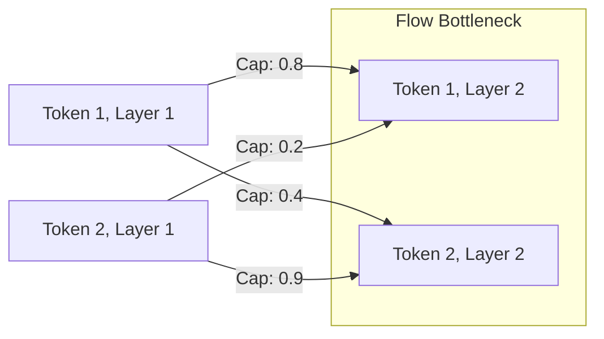

# Network Max-Flow and Attention Flow Era (~2021–2023)

Attention Flow refactors interpretability by modeling token propagation as a maximum flow problem in operations research, solving the over-smoothing and routing capacity issues of simple Rollout.

### Detailed Concept
While Attention Rollout assumes that information propagates linearly and independently, in reality, paths interact. Attention Flow treats the Transformer network as a directed flow graph where:
- Nodes represent tokens at various layers.
- Edge capacities are defined by the attention weights between tokens.
- Information routing is calculated using the maximum flow algorithm (e.g., Ford-Fulkerson).

This formulation prevents the over-smoothing seen in deep models and respects the bottleneck routing capacity of representation layers.

### Diagram
Below is a network graph showing flow routing through token capacities:

