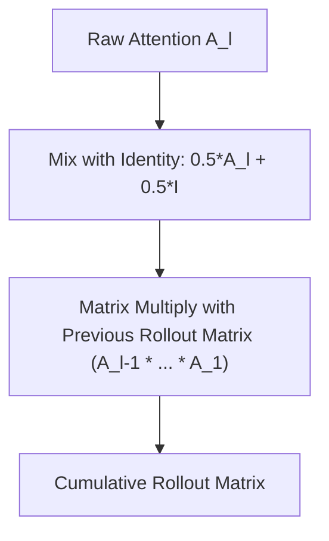

# The Linear Matrix Product (Attention Rollout, 2020)

Attention Rollout, introduced by Abnar and Zuidema (2020), addresses the layer isolation problem by recursively multiplying attention matrices across layers while accounting for residual connections.

### Detailed Concept
To track the flow of information, Attention Rollout models the self-attention mechanism as a linear propagation process.
1. **Residual Modeling:** Since a layer output is $A \cdot X + I \cdot X = (A + I)X$, Rollout updates the attention matrix at each layer to include the identity matrix:
   $$\bar{A} = 0.5 A + 0.5 I$$
2. **Recursive Multiplication:** The cumulative attention from the input to layer $L$ is calculated by multiplying the modified attention matrices of all preceding layers:
   $$\tilde{A}_L = \bar{A}_L \cdot \bar{A}_{L-1} \dots \bar{A}_1$$

### Diagram
The flowchart below illustrates how Attention Rollout recursively mixes attention matrices from the input layer up to the target layer:

