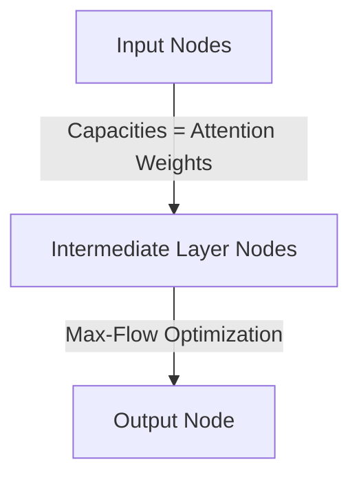

# Generic Attention Flow (Max-Flow Generalization)

Generic Attention Flow treats token attribution as a network flow problem, solving the capacity constraint issues of rollout.

### Detailed Concept
Instead of multiplication, this method constructs a graph where edge capacities are attention weights. Finding the dependency of token $j$ on input token $i$ is solved via a linear programming max-flow optimizer.

- **Pros:** Highly robust, eliminates over-smoothing, clear dependencies.
- **Cons:** Computationally expensive due to solving max-flow per token pair.

### Diagram

