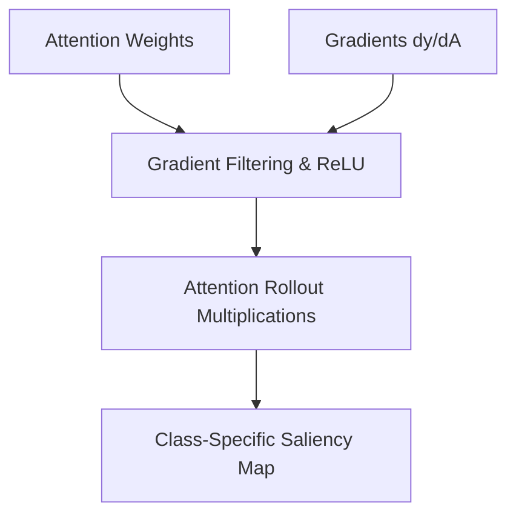

# Gradient-Weighted Attention Rollout (Grad-CAM Integration)

Gradient-Weighted Attention Rollout combines rollout matrix multiplication with downstream class gradients to provide class-specific visualizations.

### Detailed Concept
Vanilla rollout is class-agnostic. Gradient-weighted rollout scales attention weights by the gradient of the target output class logit $y_c$ with respect to the attention weights:
$$A_{\text{grad}} = A \odot \text{ReLU}\left(\frac{\partial y_c}{\partial A}\right)$$
This filters out attention heads that do not contribute to the specific class classification.

### Diagram

