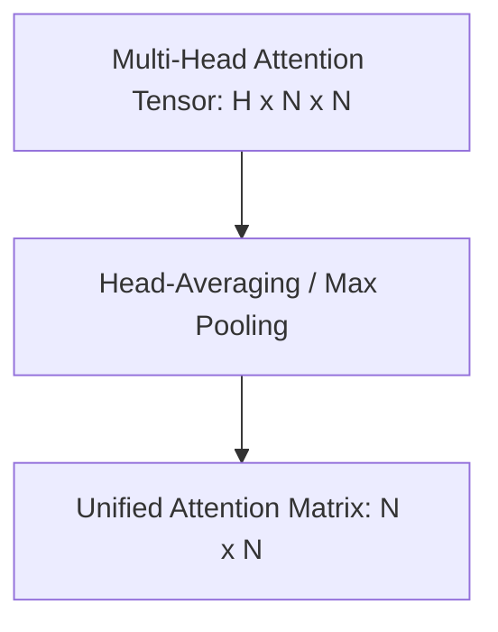

# Head-Averaging Poolers

Head-Averaging Poolers collapse the multi-head dimension of attention matrices into a single, unified matrix.

### Detailed Concept
Multi-head attention generates a tensor of shape $[H, N, N]$. To compute rollout, this tensor must be pooled to $[N, N]$. Typical poolers average across the $H$ heads, while specialized poolers use maximum value selection.

### Diagram

