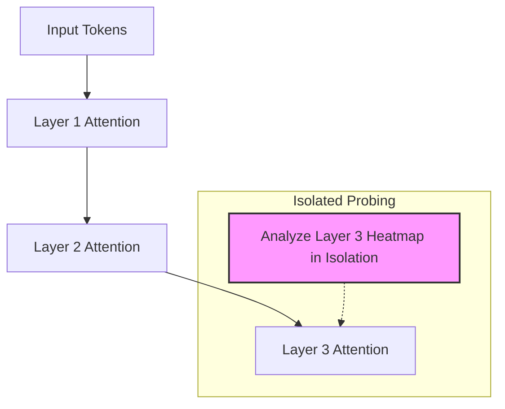

# Isolated Layer-by-Layer Probing Era (~2017–2019)

Isolated layer-by-layer probing was the standard approach to interpreting Transformer models during their initial rise. In this paradigm, researchers analyzed individual self-attention matrices at specific layers to infer token relationships.

### Detailed Concept
In the early days of Transformer interpretability, researchers extracted the attention weights directly from individual layers. For any given head $h$ in layer $l$, the attention matrix $A^{(l, h)}$ was visualized as a heatmap showing how much query tokens attended to key tokens.

### Limitations
1. **Residual Mixing:** Because Transformers stack multiple layers interspersed with residual skip connections ($x^{(l)} = x^{(l-1)} + \text{SelfAttention}(x^{(l-1)})$) and Feed-Forward Networks (FFNs), the representation vector at a deep layer is a complex mixture of features. A high attention weight in layer $L$ does not map directly back to the raw input tokens.
2. **Information Dilution:** The attention matrix at layer $L$ only captures the immediate preceding layer's mixing, ignoring the historical routing through layers $1$ to $L-1$.

### Diagram
Below is a flowchart representing the isolated probing of a single layer without routing history:

