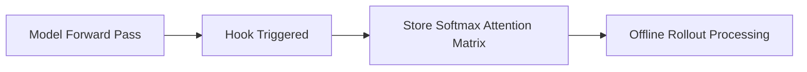

# Layer Insertion Hooks

Layer Insertion Hooks intercept self-attention activations at runtime to cache attention matrices.

### Detailed Concept
During the model forward pass, custom PyTorch hooks are registered on the self-attention modules. These hooks capture the post-softmax attention matrices and save them to CPU or GPU buffers for post-hoc rollout calculation.

### Diagram

