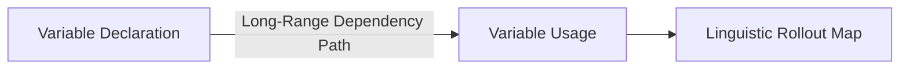

# Linguistic Syntax & Source Code Dependency Tracking

Rollout tracks how coding models resolve distant variable dependencies and compiler syntax rules.

### Detailed Concept
In autoregressive decoders, rollout maps the dependency of a predicted token back to variable declarations, function definitions, or import statements in code files, clarifying long-range syntactic reasoning.

### Diagram

