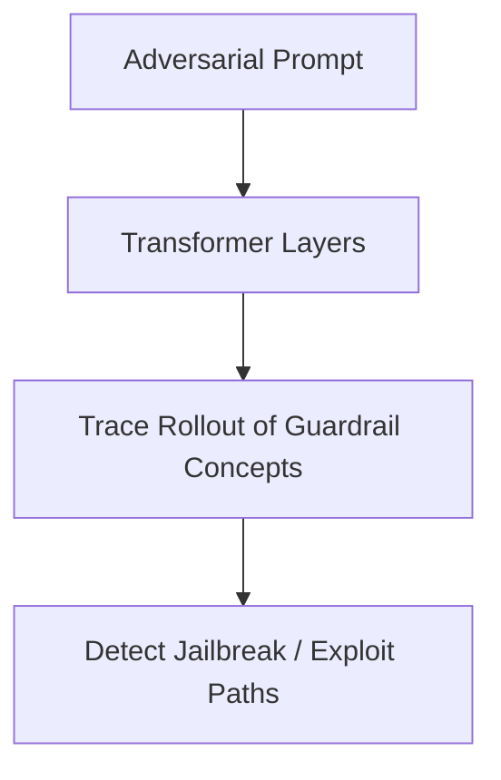

# Mechanistic Interpretability & Corporate Safety Red-Teaming Audits

Rollout-based diagnostics are used in safety red-teaming to trace prompt injection and jailbreak attacks through hidden layers.

### Detailed Concept
Safety teams trace malicious prompt tokens down the attention pathways. This reveals whether safety guardrails are being bypassed or if adversarial concepts are triggering in intermediate layers.

### Diagram

