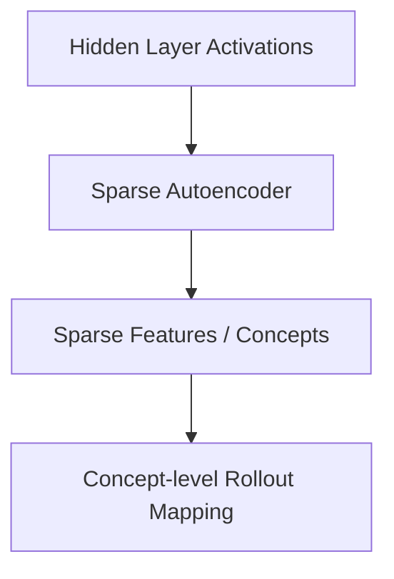

# Monosemantic Dictionary Steering Era (~2024–Present)

Modern mechanistic interpretability integrates Attention Rollout and Sparse Autoencoders (SAEs) to trace abstract, human-understandable concepts instead of raw token indices.

### Detailed Concept
Rather than tracking raw mathematical matrices of size $N \times N$, monosemantic steering maps hidden activations to an overcomplete dictionary of features using SAEs.
1. **Deconstruction:** Hidden representations are decomposed into sparse, interpretable features: $x \approx \sum_i f_i(x) d_i$.
2. **Concept Rollout:** Attention Rollout paths are evaluated relative to these features, allowing researchers to trace exactly how a concept like "security exploit" is processed and routed through self-attention layers.

### Diagram
Traces concepts instead of raw tokens:

