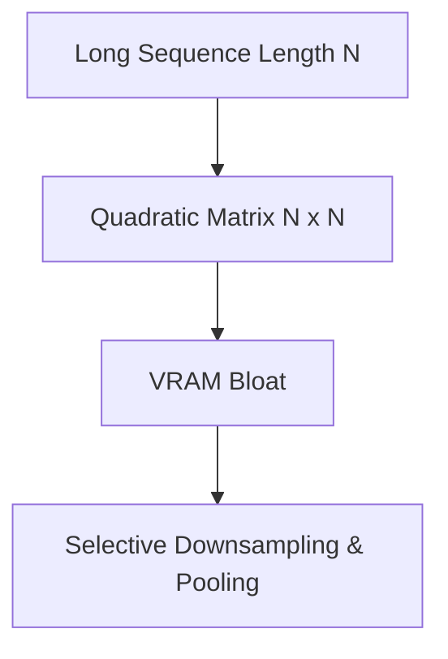

# The Quadratic Storage Cache Bloat

The quadratic scaling of attention matrices ($O(N^2)$) causes memory bloat during multi-layer tracking on long sequences.

### Detailed Concept
Storing attention maps for all layers of a model with sequence length $N$ requires storing $L \times H \times N^2$ values. For long context windows, this easily exceeds VRAM. Mitigations include downsampling layers or applying token-level semantic pooling.

### Diagram

