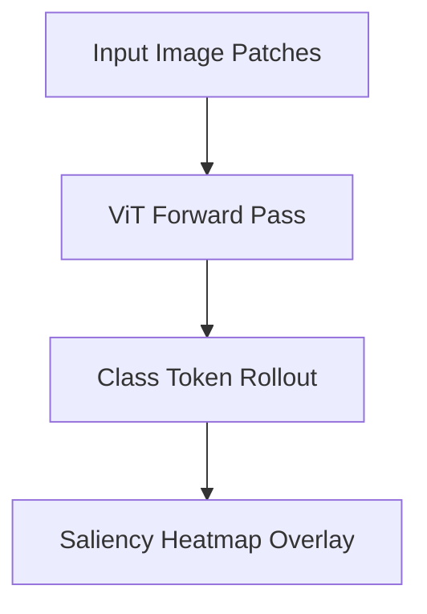

# Saliency Visualizations for Vision Transformers (ViTs)

Attention Rollout visually highlights the pixel patches a Vision Transformer focuses on during classification.

### Detailed Concept
ViT patches are mapped to token indices. Running rollout from the class token ($[CLS]$) back to the input patches yields a visual explanation of the model's spatial attention.

### Diagram

