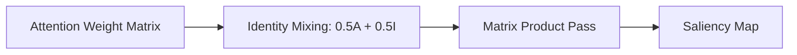

# Vanilla Attention Rollout (Raw Identity Mixing)

Vanilla Attention Rollout is the basic mathematical variant that utilizes identity matrix mixing to simulate residual skip lanes.

### Detailed Concept
By mixing the raw attention weights with the identity matrix, Vanilla Rollout models the skip connections present in Transformer blocks:
$$\bar{A} = 0.5 A + 0.5 I$$
The output map shows the linear paths from any output token back to any input token.

- **Pros:** Lightweight, requires only forward-pass attention weights, zero backpropagation.
- **Cons:** Tends to produce over-smoothed results in deep architectures.

### Diagram

